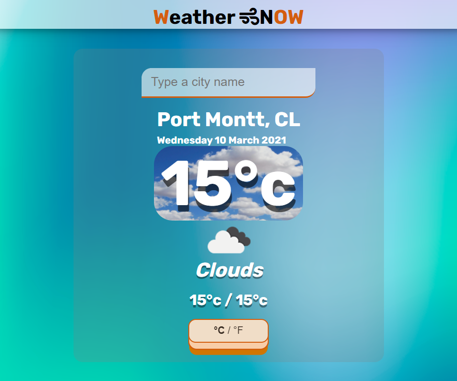

# Weather NOW

- Weather app built as a practice for API implementation.



## Live Demo

[Live version](https://karmaester.github.io/Weather-App-JS/)

## :hammer: Built With

- JavaScript
- HTML
- Sass
- Webpack
- OpenWeather API

## :construction_worker: Getting Started

To get a local copy up and running follow these simple example steps.

### Setup

- Open the console
- Download or git clone git@github.com:karmaester/Weather-App-JS.git
- cd Weather-App-JS

Install npm:

```
  npm install
```

Run npm:

```
  npm run watch
```

### Github Actions

To make sure the linters' checks using Github Actions work properly, you should follow the next steps:

1. On your recent repo, enable the GitHub Actions in the Actions tab.
2. Create the `feature/branch` and push.
3. Open a PR from the `feature/branch` when your work is done.

## :bust_in_silhouette: Author

👤 **Khristian Rojas**

- Github: [@githubhandle](https://github.com/karmaester)
- Twitter: [@twitterhandle](https://twitter.com/karmaendlich)
- Linkedin: [linkedin](https://www.linkedin.com/in/khristian-rojas/)

## 🤝 :raised_hand: :raised_hand: Contributing

Contributions, issues and feature requests are welcome!

Feel free to check the [issues page](https://github.com/karmaester/Weather-App-JS/issues).

## :muscle: Show your support

Give a ⭐️ if you like this project!

## :grey_exclamation: Acknowledgments

- Microverse
- Stand up Team
- TylerPottsDev / weather-app-js
- OpenWeather API

## 📝 License

This project is [MIT](https://opensource.org/licenses/MIT) licensed.
